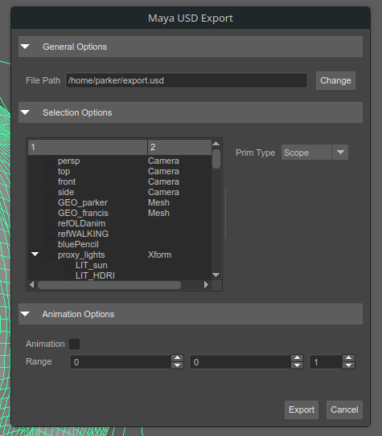
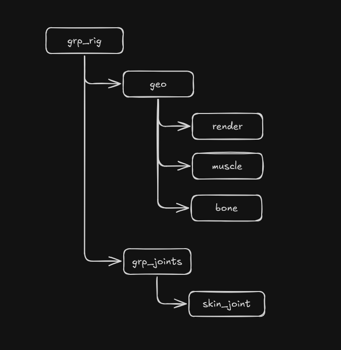

<h1 align="center">Maya USD Export</h1>
<p align="center"}>
  
  
  
</p>

This repo contains shelf tools for exporting **Maya** animations as **USD** files.

<div align="center">
    
</div>

## Features
- **Simplified inteface for exporting animated assets**
- **Capable of exporting static, animated, or cfx meshes**
- **Custom export location**
- **Custom frame range**

## Installation
### Requirements
- Autodesk Maya
- Maya USD Plugin
- Maya Alembic Plugin

### Step 1. Add to maya scripts directory
located at '''~/maya/scripts``` on linux
### Step 2. Run the code within mayas script editor or shelf tool
```python
import maya_usd_export
maya_usd_export.start_interface()
```

## Rig Requirements
**Following groups in heirarchy require specific attributes for CFX export:**
- USD_typeName:
  - grp_rig
  - geo
  - render
  - muscle
  - bone
- joints_grp
  - skin_joint

Currently grp_joints must exist for joints_grp attr to be found

**The current selection algorithm expects a rig with the following heirarcy naming:**
<div align="left">
  
</div>

# Development
### Dependencies
**pytest**  
```sh
/usr/autodesk/maya/bin/mayapy -m pip install pytest
```
### Resources
[usd export command](https://github.com/Autodesk/maya-usd/tree/dev/lib/mayaUsd/commands)
